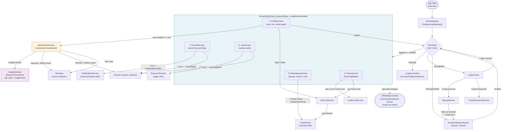

# CampusConnect Architecture

## State Management Overview

CampusConnect uses a split between UI widgets, state containers, and Firebase services:

- **UI layer**: screens and reusable widgets render the app and collect user input.
- **State layer**: `AuthProvider`, `FeedProvider`, `NavProvider`, and `SearchCubit` own UI-driven state and emit predictable updates.
- **Data layer**: `AuthService`, `FirestoreService`, and `NotificationService` talk to Firebase or platform services.

This keeps widget code focused on rendering while business and data rules stay in dedicated classes.

## State Flow

### App startup

1. `main.dart` initializes Firebase.
2. Services and providers are registered in `MultiProvider`.
3. `RootGate` listens to `AuthProvider` and selects the correct screen:
   - loading screen while auth bootstrap is pending
   - login screen when signed out
   - email verification screen when the account is unverified
   - home shell when the user is ready

### Auth flow

- `AuthProvider` owns the observable auth session state.
- `AuthService` performs Firebase Auth operations.
- If profile creation fails during sign-up, the provider rolls back the auth user so the app does not end in a partial state.

### Feed and navigation flow

- `FeedProvider` owns search text and marketplace sort direction.
- `NavProvider` owns the bottom-navigation index.
- `SearchCubit` is used for search-driven UI states that need a Bloc/Cubit rather than a plain provider.

### Data flow

- Screens subscribe to `FirestoreService` streams.
- Service methods return streams or futures, keeping Firestore logic out of widgets.
- UI code only reacts to state and displays error, empty, or loaded views.

## Predictable State Transitions

The app avoids using global mutable state directly. Instead:

- state changes happen through provider or cubit methods
- widgets observe state with `watch`, `read`, or stream builders
- loading, empty, success, and error states are handled explicitly in the UI

## UI / Data Separation

### UI layer

Examples:
- `screens/*`
- `widgets/*`

Responsibilities:
- render views
- handle taps and form input
- show loading, empty, and error states

### State layer

Examples:
- `providers/*`
- `search_cubit.dart`

Responsibilities:
- hold app or screen state
- notify UI listeners
- coordinate user-triggered transitions

### Data layer

Examples:
- `services/*`

Responsibilities:
- Firebase Auth calls
- Firestore reads and writes
- notification bootstrap and scheduling

## Why This Architecture Works

- The app is easy to reason about because each layer has one job.
- Screen widgets stay small and predictable.
- Firebase logic is reusable and testable.
- State transitions are explicit, so there are fewer hidden side effects.

## Notes

- Stream errors are surfaced in-module with user-friendly retry paths.
- The app also includes an app-wide offline banner for no-internet visibility.
- The same architecture supports the main feature areas: marketplace, events, jobs, lost/found, chats, profile, and admin moderation.

---

## Architecture Diagram

### Layered Architecture

```mermaid
flowchart TB
    subgraph UI["🖥️ UI Layer  (lib/screens  &  lib/widgets)"]
        direction TB
        BootstrapApp["BootstrapApp\n(main.dart)"]
        RootGate["RootGate\n(auth gate)"]

        subgraph Screens["Screens"]
            Login["LoginScreen"]
            Signup["SignupScreen"]
            EmailVer["EmailVerificationScreen"]
            ForgotPw["ForgotPasswordScreen"]
            HomeShell["HomeShellScreen\n(IndexedStack)"]
            Home["HomeScreen"]
            Market["MarketplaceScreen"]
            Events["EventsScreen"]
            Jobs["JobsScreen"]
            Profile["ProfileScreen"]
            ChatList["ChatListScreen"]
            Chat["ChatScreen"]
            LostFound["LostFoundScreen"]
            Admin["AdminPanelScreen"]
            Insights["InsightsScreen"]
        end

        subgraph Widgets["Reusable Widgets"]
            OfflineBanner["OfflineBannerShell"]
            EmptyState["EmptyState"]
            HeroHeader["CampusHeroHeader"]
            BottomNav["AppBottomNavBar"]
            SearchField["AppSearchField"]
            TrendChart["ReportsTrendChart"]
        end
    end

    subgraph State["⚙️ State Layer  (lib/providers)"]
        direction TB
        AuthProv["AuthProvider\n(ChangeNotifier)\n• isReady  • isLoggedIn\n• isEmailVerified"]
        FeedProv["FeedProvider\n(ChangeNotifier)\n• searchQuery\n• priceLowToHigh"]
        NavProv["NavProvider\n(ChangeNotifier)\n• navIndex"]
        SearchCubit["SearchCubit\n(Bloc/Cubit)\n• query string"]
    end

    subgraph Data["🗄️ Data Layer  (lib/services)"]
        direction TB
        AuthSvc["AuthService\n• signUpWithCollegeEmail\n• login / logout\n• forgotPassword\n• resendVerification"]
        FirestoreSvc["FirestoreService\n• watchMarketplace\n• watchEvents / watchPendingEvents\n• watchJobs / watchLostFound\n• watchReports\n• createOrGetChat / sendMessage\n• approveEvent / rejectEvent\n• banUser / reportSpam"]
        NotifSvc["NotificationService\n• initialize (FCM)\n• subscribeToGeneralTopics\n• scheduleEventReminder"]
        AnalyticsSvc["AnalyticsService\n• logLogin\n• logSearch\n• logCreatePost"]
    end

    subgraph Firebase["☁️ Firebase Platform"]
        direction LR
        FBAuth["Firebase Auth"]
        Firestore["Cloud Firestore"]
        FCM["Firebase Messaging\n(FCM)"]
        FBAnalytics["Firebase Analytics"]
        FBStorage["Firebase Storage\n(configured)"]
    end

    subgraph Models["📦 Data Models  (lib/models)"]
        direction LR
        UserModel["UserModel"]
        MarketModel["MarketplaceModel"]
        EventModel["EventModel"]
        JobModel["JobModel"]
        LFModel["LostFoundModel"]
        ReportModel["ReportModel"]
        ChatMsgModel["ChatMessageModel"]
    end

    %% UI → State wiring
    RootGate -->|"context.watch"| AuthProv
    HomeShell -->|"context.watch"| NavProv
    Market -->|"context.watch"| FeedProv
    Events -->|"context.watch"| FeedProv
    Jobs -->|"context.watch"| FeedProv

    %% State → Data wiring
    AuthProv -->|"delegates to"| AuthSvc
    AuthProv -->|"creates profile via"| FirestoreSvc

    %% UI → Data (streams / futures)
    Market -->|"StreamBuilder"| FirestoreSvc
    Events -->|"StreamBuilder"| FirestoreSvc
    Jobs -->|"StreamBuilder"| FirestoreSvc
    LostFound -->|"StreamBuilder"| FirestoreSvc
    Chat -->|"StreamBuilder"| FirestoreSvc
    Admin -->|"StreamBuilder"| FirestoreSvc
    Profile -->|"StreamBuilder"| FirestoreSvc
    TrendChart -->|"StreamBuilder"| FirestoreSvc
    Events -->|"scheduleReminder"| NotifSvc
    Market -->|"logCreatePost"| AnalyticsSvc

    %% Data → Firebase
    AuthSvc --> FBAuth
    FirestoreSvc --> Firestore
    NotifSvc --> FCM
    AnalyticsSvc --> FBAnalytics

    %% Models ↔ Firestore
    Firestore <-->|"fromMap / toMap"| Models

    %% Offline detection
    OfflineBanner -->|"TCP+DNS+HTTP probe"| ConnPlus["connectivity_plus\n+ dart:io Socket"]

    style UI fill:#e8f4f8,stroke:#0B7285
    style State fill:#e8f5e9,stroke:#1B8A5A
    style Data fill:#fff8e1,stroke:#B7791F
    style Firebase fill:#fce4ec,stroke:#c62828
    style Models fill:#f3e5f5,stroke:#6a1b9a
```

---

### Screen Navigation Flow

