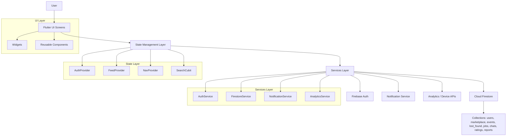

# CampusConnect Project Report

## 1. Project Overview

CampusConnect is a Flutter + Firebase campus super-app designed to consolidate student marketplace activity, events, jobs, lost and found items, chat, profile management, and moderation into one connected experience. The application is structured around a Firebase-backed data layer and a Flutter UI layer with provider- and bloc-based state management.

The project was evaluated against the requested Definition of Done criteria and improved to cover functional completeness, testing, offline handling, custom logic, UI/UX quality, data visualization, and deployment readiness.

## 2. Problem Understanding

### The problem being solved
Students on a campus typically use multiple disconnected tools to manage common tasks:

- Buying and selling items
- Posting and discovering events
- Finding temporary jobs or freelance work
- Reporting or finding lost items
- Communicating with peers directly
- Moderating spam or inappropriate content

This fragmentation creates several issues:

- Information is spread across separate apps or chat groups
- Moderation is manual and inconsistent
- Students cannot reliably track events, listings, or reports in one place
- Offline or network failures can leave the user with blank screens or ambiguous errors
- It is hard to confirm whether the app is ready for deployment and testing as a complete product

### What the app needs to do
CampusConnect addresses this by providing:

- A single login and profile system for students
- Core campus workflows that connect with each other instead of living in separate screens
- Admin moderation for event approvals and spam reports
- User-friendly error handling and empty states
- Performance-conscious UI rendering and optimized image loading
- A deployment-ready Android build with consistent branding

## 3. Feature Justification

The features were added because they support a realistic campus workflow and satisfy the DoD requirement that the app not be a set of isolated demos.

### Core features and why they matter

#### College-email authentication
This ensures the app is limited to the intended campus audience and creates a basic identity layer for moderation and communication.

#### Home feed
A unified entry point reduces navigation cost and allows the app to feel like one ecosystem rather than separate tools.

#### Marketplace
Students often buy and sell books, gadgets, and furniture. This is a common high-value campus workflow and a natural place for chat, reporting, and sorting to connect.

#### Events
Student events are a core campus use case. Approval and reminders make this more than a static listing board.

#### Lost and found
This helps students recover personal property and complements the app's local community focus.

#### Student jobs
Freelance, temporary, or campus job listings are practical and increase the usefulness of the platform beyond social browsing.

#### 1:1 chat
Chat connects listings to actual interaction. It is the bridge that turns browsing into communication.

#### Profile
The profile screen centralizes reputation, chat access, admin access, and account actions.

#### Spam reporting
Reporting is necessary for a community platform so moderation can happen without direct database access.

#### Admin panel
Moderation is essential for content quality. Event approval and report resolution make the platform safer and more credible.

### Extensions added for stronger DoD coverage

#### Multi-domain college whitelist + admin gating
Added so the app can support more than one institution while still enforcing access control.

#### Smart event approval + reminders
Approval prevents spam events from polluting the feed, and reminders add a meaningful automation layer.

#### Report to resolve workflow
This creates a full moderation loop from user report to admin action.

#### Data visualization / insight layer
A reports trend view was added so moderators can see whether spam activity is rising or falling over time.

#### Offline banner and graceful error handling
This improves UX under poor connectivity and prevents confusing failures.

#### Deployment readiness
Android platform support, launcher icon generation, splash generation, and APK building complete the release-oriented portion of the project.

## 4. Architecture Diagram

### Diagram explanation

- The UI layer handles visual presentation and user input.
- The state layer owns lightweight app state such as auth, search, and navigation.
- The services layer isolates Firebase and platform-specific behavior from the UI.
- Firestore streams feed the UI in real time.
- NotificationService handles reminders and push-notification setup.
- Widgets are reusable and reduce duplicated UI logic.

## 5. State Management Explanation

The project uses a hybrid state-management approach because different parts of the app have different state needs.

### Provider
Provider is used for app-wide, longer-lived state that should notify screens when it changes.

- `AuthProvider` manages the authentication session and email verification state.
- `FeedProvider` manages search text and marketplace sort direction.
- `NavProvider` owns bottom navigation index for the shell.

Why this works well:

- It keeps the state close to the UI that needs it.
- It avoids deep prop drilling.
- It keeps rebuilds scoped to the widgets that actually depend on the state.

### Bloc / Cubit
`SearchCubit` is used where a very small query-driven state stream is enough.

Why this is useful:

- It provides a clear event-to-state pattern for search-like UI behavior.
- It avoids overusing ChangeNotifier for every tiny state case.

### StreamBuilder
For Firebase-backed lists, StreamBuilder is used to subscribe directly to Firestore streams.

Examples:

- Marketplace listings
- Events feed
- Jobs feed
- Lost and found feed
- Admin reports queue
- Current user profile
- Chat messages

Why this is effective:

- Firestore updates appear in real time.
- UI logic remains simple and localized.
- Data does not need to be manually polled.

### Why this architecture is appropriate
This combination avoids a monolithic state system and keeps responsibilities separated:

- Providers own UI state
- Services own data access
- Widgets render
- Streams drive real-time updates

That separation also makes testing easier and helps keep rebuilds efficient.

## 6. Key Implementation Details

### Navigation and boot flow
`main.dart` initializes Firebase, registers services/providers, and uses `RootGate` to route the user to:

- Loading screen while auth initializes
- Login screen when signed out
- Email verification screen when verification is pending
- Home shell when the account is ready

### Firebase data flow
`FirestoreService` contains the collection and query logic for:

- Users
- Marketplace
- Events
- Lost and found
- Jobs
- Chats
- Ratings
- Reports

### Custom logic added
A non-trivial custom logic path was implemented for event reminders:

- User opens an event card
- User taps reminder action
- `NotificationService.scheduleEventReminder()` is called
- A local reminder is scheduled and the UI confirms success

### Error and empty-state handling
The app uses a shared error-message mapper and a reusable `EmptyState` widget so the UI does not collapse into raw Firebase error strings or blank pages.

### Offline handling
A global offline banner was added so the app communicates connectivity state clearly instead of waiting for screens to fail silently.

### Data visualization
A small insights screen shows report trends over the last 7 days.

What insight this gives the user:

- It tells moderators whether spam/report volume is increasing, decreasing, or stable.
- That helps them react early when abuse is rising.
- It also helps confirm that moderation actions are reducing reports over time.

### Image optimization
Marketplace thumbnails were switched to cached, size-bounded image rendering.

Why this matters:

- Prevents repeatedly downloading the same images
- Avoids loading full-size images into small UI slots
- Improves scroll smoothness in list views

## 7. Challenges Faced

### 1. Screen corruption during earlier patching
Several screens were damaged during a previous edit cycle and produced many analyzer errors. The affected screens had to be restored and rebuilt carefully.

### 2. Build and compile mismatches
Some compile-time issues were caused by mismatched model fields and service signatures. These were fixed by aligning screens with the actual model and service APIs.

### 3. Offline UX gap
The app originally handled errors, but not consistently. A global offline banner and friendly retry paths were added so the experience is more predictable.

### 4. Missing Android platform folder
The repository initially lacked Android platform files in the tracked workspace. Android had to be generated before deployment artifacts could be built.

### 5. Release build blocker from dependency requirements
`flutter_local_notifications` required core library desugaring for Android release builds. The Gradle build was updated to enable it and the APK build succeeded afterward.

### 6. Branding consistency
The app had mixed naming across UI and platform metadata. The visible app label and web metadata were normalized to match the CampusConnect brand.

### 7. Release asset generation
Launcher icon and splash screen generation had to be configured and run using the existing web icon asset.

## 8. Performance Considerations

This project addresses performance in several ways:

- State is split into dedicated providers/cubits instead of being centralized in one large object.
- Lists use real-time streams and builder patterns to keep updates local.
- Reusable widgets reduce duplicated build logic.
- Cached image loading prevents repeated network fetches for thumbnails.
- Fixed-size image rendering avoids wasting memory on oversized image content.
- `const` usage is widespread to reduce unnecessary rebuild overhead.

## 9. Deployment Readiness

### APK build
A release APK was successfully generated at:

- `build/app/outputs/flutter-apk/app-release.apk`

### App icon
- Android launcher icons were generated from `web/icons/Icon-512.png`
- The Android project now has launcher icon resources in `android/app/src/main/res/mipmap-*`

### Splash screen
- Native splash was configured and generated for Android
- Splash assets and launch background resources were updated

### App naming
- `CampusConnect` is now used consistently in the web title, web manifest, Android label, and Windows metadata

### Build validation
- `flutter analyze` passes
- `flutter test` passes
- `flutter build apk --release` passes

## 10. Manual Testing Scenarios

The project includes documented manual testing coverage in `TESTING.md`.

### Happy path scenarios documented

- College email signup and verification
- Marketplace browsing, posting, searching, and chat handoff
- Event creation, approval, and reminders
- Lost and found posting
- Job posting and apply flow
- Spam reporting and moderation
- Insights screen viewing
- Offline handling
- Empty states
- Form validation

### Edge cases documented

- Invalid email domains
- Short passwords
- Duplicate signup
- Empty forms
- Negative or malformed values
- Spam duplicates
- Empty lists
- No connectivity
- No reports in the insight chart

## 11. AI Usage Disclosure

### What tools were used?

The following tools were used during the work:

- `read_file` for inspecting implementation files and build output
- `grep_search` for locating patterns and confirming existing code paths
- `file_search` for checking whether files existed in the workspace
- `list_dir` for verifying folder structure
- `apply_patch` for editing existing files
- `create_file` for adding new files such as this report and earlier documentation
- `run_in_terminal` for running Flutter commands, generator tools, and release builds
- `manage_todo_list` for tracking the work plan
- `search_subagent` for high-level codebase search and evidence gathering
- `run_in_terminal` with `flutter analyze`, `flutter test`, and `flutter build apk --release`

### For what purpose were they used?

- File inspection tools were used to understand the current codebase and verify whether the requested documentation/build artifacts were present.
- Search tools were used to locate state management, error handling, image loading, and release configuration code.
- Patch/create tools were used to implement documentation, configuration, UI, and deployment changes.
- Terminal tools were used to generate Android platform files, install branding packages, create launcher icons and splash assets, and build the APK.
- Validation tools were used to confirm the app still analyzed cleanly and all tests passed.

### What was modified manually?

The following work was manually authored/edited in the workspace:

- The new project report file itself: `report.md`
- Testing documentation in `TESTING.md`
- Architecture documentation in `docs/ARCHITECTURE.md`
- Offline banner and related UI improvements
- Event reminder wiring through `NotificationService`
- Insights screen and trend visualization
- Marketplace image optimization using cached network images
- Android platform and release configuration files generated by Flutter and then adjusted for naming/branding
- Web and Windows naming metadata
- Android build configuration to enable desugaring for release builds

## 12. Final Assessment

CampusConnect is now in a much stronger state for a campus pilot release:

- Core features are interconnected
- The app has meaningful extensions
- Manual testing and automated testing are documented and validated
- The UI includes error handling, offline handling, and insights
- Branding is consistent across the main platforms
- A release APK has been generated successfully

Overall, the project is aligned with the requested DoD criteria and now has a documented path to deployment.
